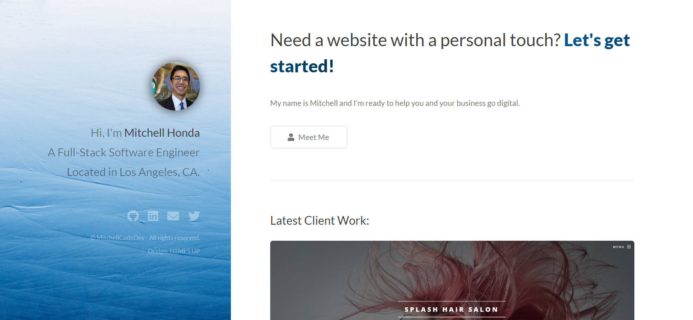

<h1> Portfolio | <a href='https://mitchellh.netlify.app/'>Visit here!</a></h1>

<h2>Tech Used</h2>
<ul>
<li>HTML</li>
<li>CSS</li>
<li>JavaScript</li>
</ul>

 

<h2>What was learned</h2>

<ul>
<li>Dynamic styling - Manipulating CSS with JS</li>
<li>Rendering blog articles with API</li>
<li>Setting up custom DNS</li>
</ul>

 
 
<h2>Optimizations</h2>
<ul>
<li>Improve styling</li>
<li>Self-hosted blog</li>
<li>Carousel for blog posts</li>
<li>Add modal boxes for each project (with description)</li>
</ul>

 

